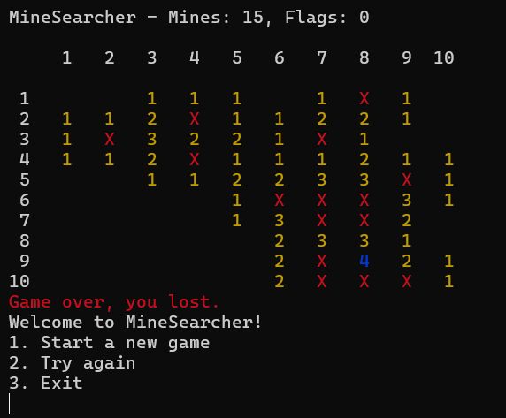

I would like to introduce to you my version of a popular game `Minesweeper`

### How it looks


### To start this game please run
```
irb -Ilib -r game -r board -r cell -r cli
```
for uploading all files and running a console.

### Then
```
CLI.new.start
```
and follow instructions


### Place for improvements
- Add a default game settings (10, 40, 100 mines)
- Add a leaderboard table (count clicks)
